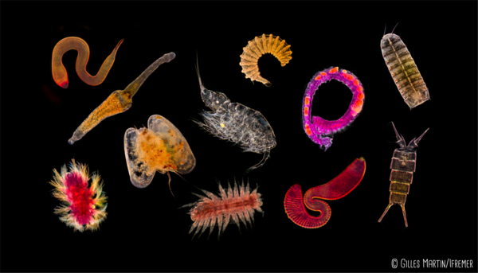

# MeioMIX documentation
{: style="display: block; margin-left: auto; margin-right: auto;" }

Welcome to the documentation for the MeioMIX prototype! Developed as part of the Blue Revolution project, this prototype aims to automate and speed up meiofauna extraction processes using decantation.

To learn more about the global project, visit the [Blue Revolution website](https://bluerevolution.ifremer.fr/).

## What is the MeioMIX?

*Meiofauna* define a diverse assemblage of small benthic invertebrates (*i.e.* living in the sediment) whose size ranges from 40µm to 1mm. They are some of the most diverse group of organisms on Earth, and are ideal ecological indicators and sentinel for ecosystems health. This means that by studying them, we can deduce the state of a specific environment, and the impacts that human activity has on ecosystems.

Yet only a small part of this diversity has been described, and knowledge of their biology and ecology is fragmentary. To remedy this... blablablabla to complete. 
